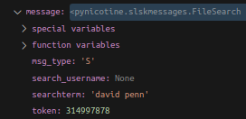
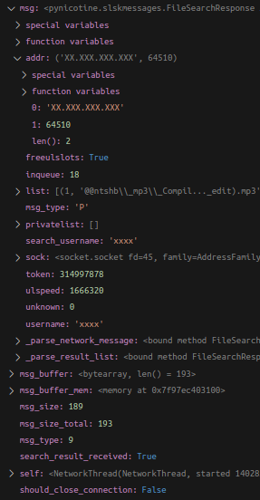

# Code Documentation

## Start

The execution of the software starts in the file `nicotine` that can be found in the root of the repository.

## Search
`Under construction`
### File Request

When the user enters a string in the search bar and presses the Enter key, the `on_search` handler is executed in the file `pynicotine/gtkgui/mainwindow.py`. From that moment, the flow is:

|Order|File|Function|
|-|-|-|
|1|pynicotine/gtkgui/mainwindow.py|on_search|
|2|pynicotine/gtkgui/search.py|on_search|
|3|pynicotine/search.py|do_search|
|4|pynicotine/search.py|do_global_search|
|5|pynicotine/core.py|send_message_to_peer|
|6|pynicotine/slskproto.py|_queue_network_message|

In step 4, the message type `FileSearch` is created and sent as string to the core, where the event `"queue-network-message"` is emitted. It is in the file `slskproto.py` where the message is really enqueued and sent to the server. The message the is sent to the server contains the following information:

Note that the token attribute will be used for the replies to that search.

### File Response

Once the server receives the message, we have to wait for the replies (internally, the protocol is broadcasting out search to all the peers and we will receive the matches from the peers that are sharing that file). They arrive through the same `slskproto.py` file from class `NetworkThread`. The flow then is:

|Order|File|Function|
|-|-|-|
|1|pynicotine/slskproto.py|_process_peer_input|
|2|pynicotine/slskproto.py|_emit_network_message_event|
|3|pynicotine/search.py|_file_search_response|
|4|pynicotine/gtkgui/search.py|file_search_response|
|5|pynicotine/gtkgui/search.py|page.file_search_response|

In step 2, the event `"file-search-response"` is emitted and callbacks in steps 3 and 4 are executed one after the other. The message that is received contains the following information (sensible information has been modified like username and IP)

)

`"file-download-progress"` event

## Download

After you make a search and you want to download a file, you can either double click on the file or via context menu. When you do it, the function `on_download_files` is triggered on the file `pynicotine/gtkgui/search.py`. The complete flow is

|Order|File|Function|
|-|-|-|
|1|pynicotine/gtkgui/search.py|on_download_files|
|2|pynicotine/downloads.py|enqueue_download|
|3|pynicotine/transfers.py|_enqueue_transfer|

In step 2, an object of type `Transfer` is created and added to the `transfers` list that is instantiated in the `pynicotine/transfers.py` class. `Transfer` class is the base class for `Downloads` and `Uploads` classes. In step 3 a `QueueUpload` message is sent to the peer. This message is used to tell a peer that an upload should be queued on their end. Once the recipient is ready to transfer the requested file, they will send a TransferRequest to us.

CONTINUE HERE => `TransferRequest` message. Investigate...

### Download started/finished

downloads.py => _file_transfer_init => events.emit("download-notification")
downloads.py => _finish_transfer => events.emit("download-notification", finished)

